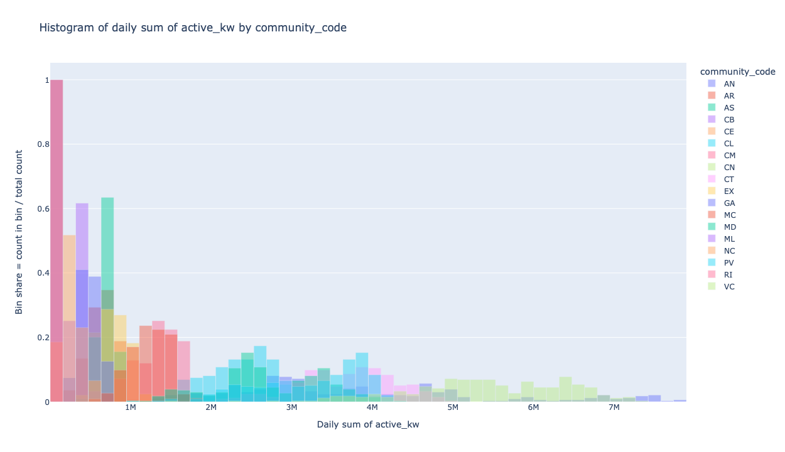
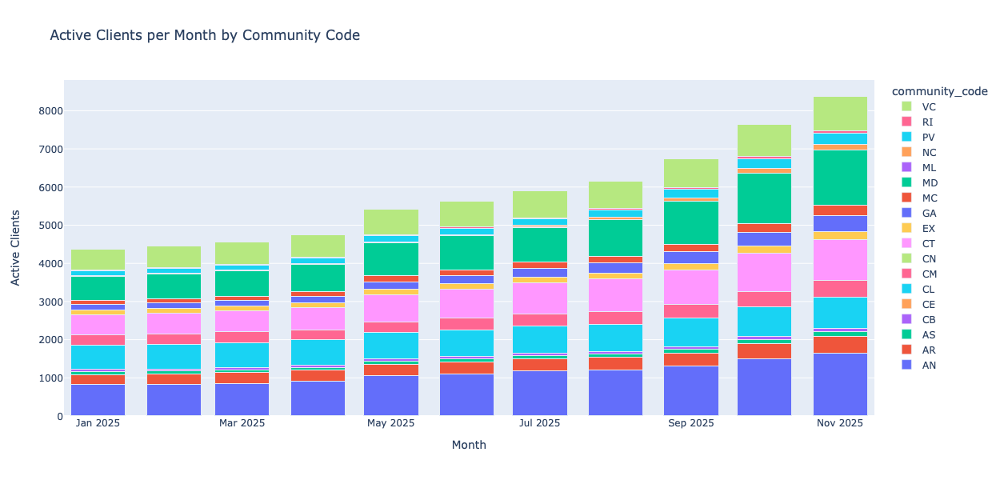
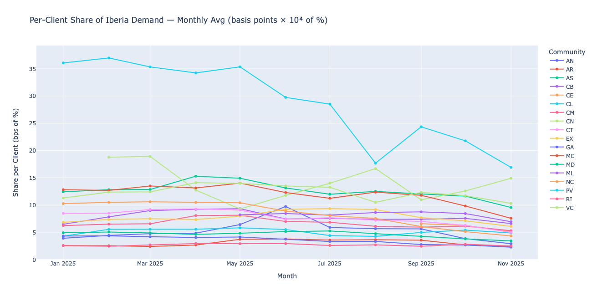
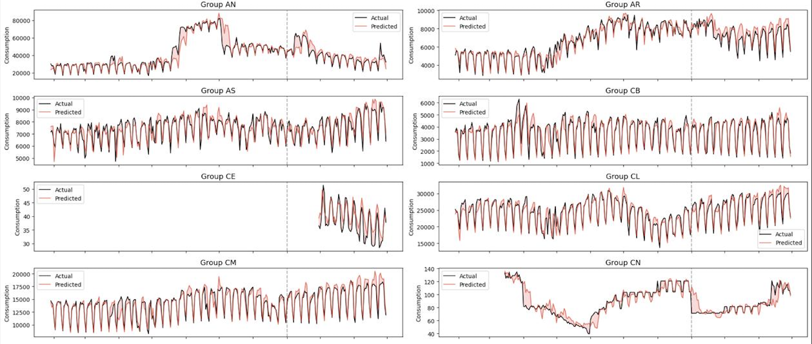

# Iberia Retail Energy Consumption Forecasting
### ETH Datathon 2025 — Axpo × Databricks challenge · 2nd place

This repository documents the day-ahead electricity consumption forecasting
pipeline we built at the **ETH Datathon 2025**, the largest data-science /
machine-learning competition in Switzerland (hosted at ETH Zürich). The
challenge — titled *"Iberia Retail Consumption Forecasting"* — was designed
by **Axpo** in partnership with **Databricks**, and our solution was ranked
**2nd overall** among the participating teams.

> **No data in this repository.** The competition dataset (client-level
> metered consumption, Spain demand / PV / wind forecasts, weather, etc.) is
> covered by an Axpo non-disclosure agreement and lived exclusively inside a
> Databricks Unity Catalog. What you will find here is the **idea, the
> reasoning, and the pipeline** that produced our best score — presented in a
> way that is faithful to the submitted notebook but strictly leakage-free.

---

## Team

| Member | LinkedIn |
|--------|----------|
| **Arthur Vianna**   | <https://www.linkedin.com/in/arthur-vianna-3b83942b0/> |
| **Yanis Fallet**    | <https://www.linkedin.com/in/yanisfallet/> |
| **Nicolaj Thomsen** | <https://www.linkedin.com/in/tj213/> |
| **Arthur Windels**  | <https://www.linkedin.com/in/arthurwindels/> |

---

## The Challenge

> "You take on the role of a retail energy supplier operating in the Iberian
> market. Your objective is to develop a forecasting model that minimises the
> consumption forecast error of your client portfolio in order to reduce
> imbalance." — *Axpo challenge brief*

### Context

In liberalised electricity markets (Iberia operates under the **MIBEL** day-
ahead auction), retailers buy electricity on wholesale markets and resell it
to end consumers. They must declare their expected consumption **before 12:00
on day D-1** for every 15-minute interval of day D. Any deviation between
declared and realised consumption is called an **imbalance**, and is settled
at prices that are always *less* favourable than the day-ahead price:

| Situation | Outcome |
|-----------|---------|
| Procured too much → *long* | sell the surplus back at a discount |
| Procured too little → *short* | buy the deficit at a premium |

The larger the forecast error, the larger the imbalance cost. **Minimising
MAE is therefore the direct lever for P&L.**

### Task

- Produce day-ahead forecasts (before 12:00 of D-1) of the **total portfolio
  active power** at 15-minute granularity, for every 15-min interval of day D.
- Metric: **Mean Absolute Error (MAE)** over the test window
  *1 Dec 2025 – 28 Feb 2026*.
- Training data: client-level consumption for **1 Jan 2025 – 30 Nov 2025**.
- Free to enrich with any public dataset; no data leakage allowed.

### Data

All tables were provided in Databricks Unity Catalog (`datathon.*`):

| Table | Description |
|-------|-------------|
| `datathon.shared.client_consumption`      | Per-client `active_kw` at 15 min, 2025-01 → 2025-11 |
| `datathon.shared.demand_forecast`         | Spain day-ahead demand forecast (REE) |
| `datathon.shared.pv_production_forecast`  | PV production forecast |
| `datathon.shared.wind_production_forecast`| Wind production forecast |

---

## Our solution

### Why modelling `active_kw` directly is hard

Three pathologies of the raw target made a monolithic regressor on
`active_kw` a bad idea from the start:

- **Scale heterogeneity.** Daily totals per community span more than an
  order of magnitude: large industrial regions dwarf the small rural ones,
  so any mean-squared loss on the raw level is dominated by a handful of
  regions and fits the rest poorly.
- **Portfolio growth.** Client count grew from ≈4.4k to ≈8.4k over 2025 —
  the portfolio roughly doubled. A model trained on total consumption
  cannot tell apart a change in *behaviour* from a change in *portfolio
  size*, and will happily extrapolate the growth trend into the test
  horizon.
- **A few dominant clients.** Within several communities, a single large
  industrial consumer accounts for most of the regional load. Their
  idiosyncratic schedules corrupt the aggregate signal and make per-client
  averages unstable.

### Re-targeting the problem: the α share

Instead of forecasting `active_kw` we forecast a **per-community, per-client
share of Spain's day-ahead demand forecast**:

$$
\alpha(c, t) = \frac{\sum_{j\in c} y_j(t)}{n(c,t) \cdot \hat{D}_\text{Spain}(t)}
$$

where $y_j(t)$ is client $j$'s `active_kw`, $n(c,t)$ is the number of
active clients in community $c$ at $t$, and $\hat{D}_\text{Spain}(t)$ is
the REE day-ahead demand forecast for Spain (published long before 12:00
on D-1, so leakage-free).

This re-parameterisation is powerful because the denominator does most of
the heavy lifting *for free*:

- $\hat{D}_\text{Spain}$ already encodes daily and weekly seasonality,
  national calendar effects, and the dominant weather response (temperature
  swings, heating/cooling load).
- Dividing by $n(c,t)$ neutralises portfolio growth — α is per-client, not
  per-portfolio.

Empirically, α is near-stationary for the vast majority of communities
(see [`assets/alpha_per_community.png`](assets/alpha_per_community.png)),
which turns a noisy non-stationary regression into a much tamer problem.

### Baseline: α-lag-7 (zero fitted parameters)

The simplest honest predictor of α at time $t$ is its value one week
earlier — human activity is strongly weekly-periodic, so Monday 09:00
behaves like last Monday 09:00:

$$
\hat{\alpha}(c, t) = \alpha(c,\, D-7)
$$

Scaling back by today's known quantities gives our structural portfolio
forecast:

$$
\hat{y}_\text{portfolio}(t) = \sum_{c} \alpha(c,\, D-7) \cdot n(c,\, D-2) \cdot \hat{D}_\text{Spain}(t)
$$

Every term is strictly available before 12:00 on day D-1:

- $\alpha(c, D-7)$ comes from the metering data of seven days ago.
- $n(c, D-2)$ is the most recent reliable count of active clients.
- $\hat{D}_\text{Spain}(t)$ is the published REE forecast.

No parameters are fitted, no hyperparameters are tuned. On a held-out
slice of the training period this baseline achieves **MAE ≈ 15,305 kW** —
already a strong starting point.

### Residual LightGBM per community (leakage-free)

To close the remaining gap we fit a **dedicated `LightGBM` regressor per
community** on the baseline's residual:

$$
\varepsilon(c, t) = \sum_{j\in c} y_j(t) - \alpha(c,\, D-7) \cdot n(c,\, D-2) \cdot \hat{D}_\text{Spain}(t)
$$

The residual target is small, closer to zero-mean, and concentrates the
community-specific quirks the structural model ignores (local holidays,
weather anomalies, industrial shifts). Training one model per community
lets each one specialise to its climate and industrial mix rather than
averaging across regions.

Features fed to each LightGBM are strictly leakage-free — nothing from
time $t$ or later ever enters the training matrix:

- **Weather forecast snapshot taken at D-2** (Open-Meteo): temperature,
  heating/cooling degree-days, shortwave radiation, humidity, wind speed.
  We never use the observed weather at $t$.
- **Calendar encodings**: 15-minute-of-day, day-of-week, day-of-month,
  day-of-year, plus their sin/cos cyclical variants; Spanish national and
  regional holidays, and *puente* bridge days.
- **Lag and rolling statistics of α** (lag-2/7/14/21/28 days, rolling
  mean/std over 7/28 days, same-day-of-week rolling mean).

### Handling big clients

Averaging over $n(c, t)$ implicitly assumes clients inside a community
are roughly comparable in scale. That assumption breaks for the handful
of industrial clients that consume orders of magnitude more than the
rest: their entry or exit shifts the community α dramatically (visible
as the drift on `CL` in [`assets/alpha_per_community.png`](assets/alpha_per_community.png)).

To fix this we identified the **top consumers on the training window
only** (no leakage into validation) and promoted each of them to their
own synthetic "community" with a dedicated LightGBM sub-model. The
remaining community keeps a clean, stable α.

### Final forecast

$$
\hat{y}_\text{portfolio}(t) = \sum_{c \in \text{communities}} \big[\text{baseline}(c,t) + \hat{\varepsilon}(c,t)\big] + \sum_{k \in \text{big clients}} \big[\text{baseline}(k,t) + \hat{\varepsilon}_k(t)\big]
$$

On a held-out slice of the training period this full pipeline reaches
**MAE ≈ 12,000 kW** — a material improvement over the already-strong
structural baseline.

### Cross-validation

All training-derived artefacts (big-client list, LightGBM fits, α lags)
are recomputed inside every fold of a forward-only
`sklearn.model_selection.TimeSeriesSplit`, with a mandatory gap of two
days between the last training timestamp and the first validation
timestamp so that no D-2 / D-7 feature window of the validation fold
ever touches the training window. The helper `time_series_cv(...)` in
`src/submission.py` runs this loop end-to-end.

> For the full narrative (plots, ablations, failed experiments) see the
> [presentation PDF](presentation.pdf).

---

## Key plots

### Raw consumption is heterogeneous across the 17 communities

Daily totals span more than an order of magnitude between regions — any model
on raw `active_kw` is dominated by the largest ones.

### Portfolio roughly doubled over the training window

A model on total consumption would absorb this trend and extrapolate it
blindly. Normalising by `n(c, t)` solves that.

### α is near-stationary for most communities

Monthly-averaged per-client share of Spain demand. Most communities sit in a
narrow band → α is much easier to predict than `active_kw`.

### Final forecast vs. observed (held-out slice of training)

---

## Acknowledgements

- **Axpo** for designing the challenge and sharing the portfolio data.
- **Databricks** for providing the workspace and compute.
- **Analytics Club at ETH** / **ETH Datathon organisers** for running the
  biggest data-science event in Switzerland.
- **Open-Meteo** for the weather forecast API that powered our D-2
  weather features.
